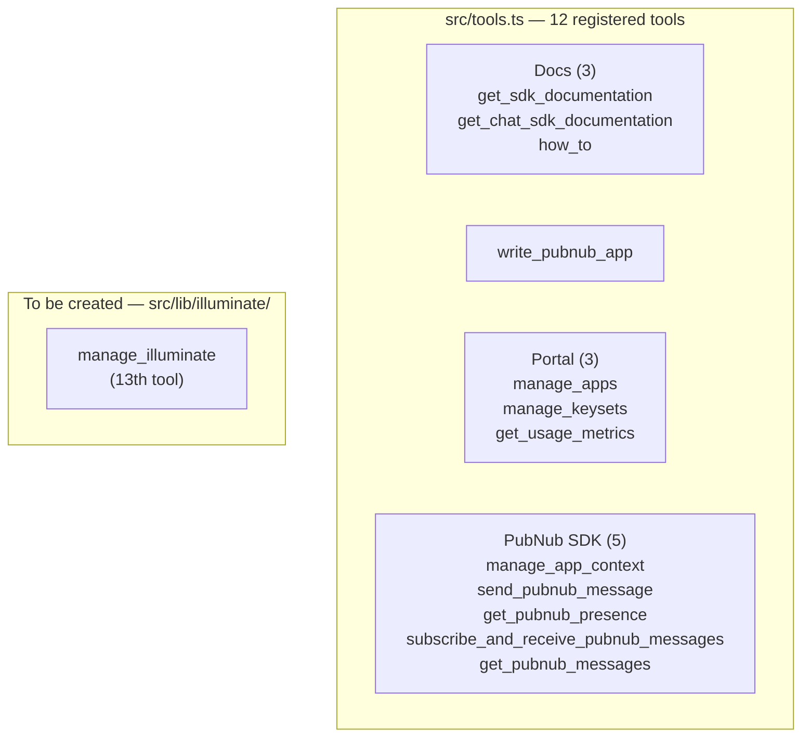
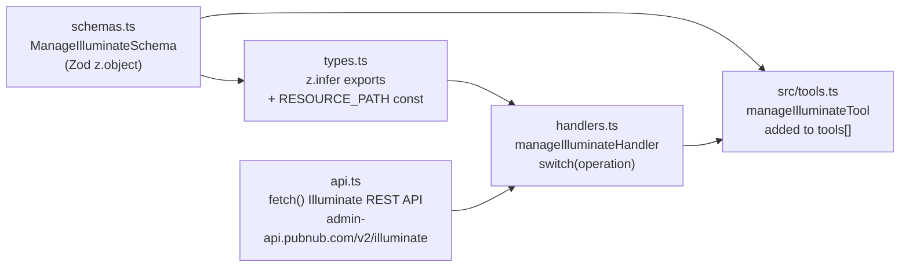
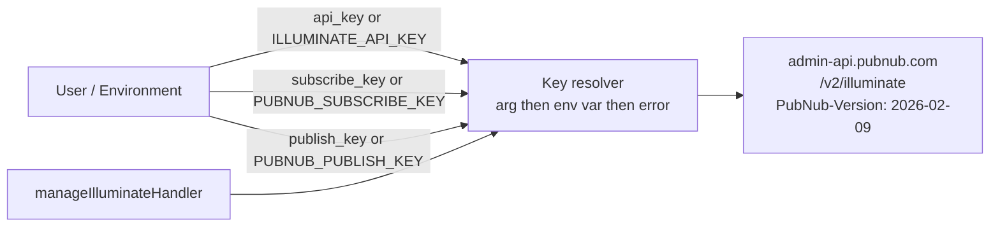
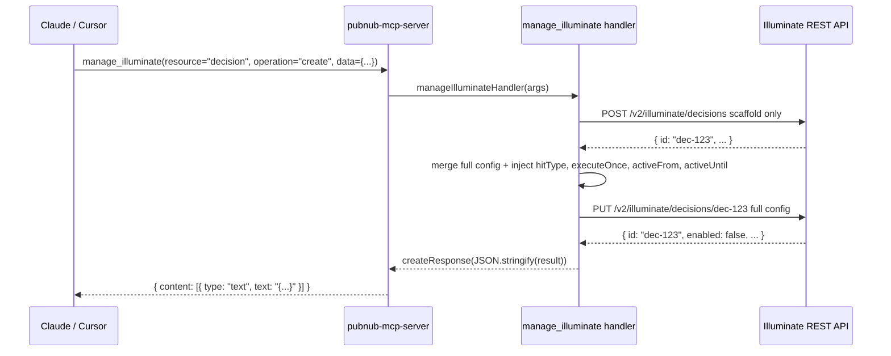

# Illuminate MCP — Integration Plan

---

## TL;DR

- Add one new tool, `manage_illuminate`, to the `@pubnub/mcp` npm package alongside the existing 12 tools
- The tool covers full CRUD for all 5 Illuminate resource types **plus** testing and data-analysis operations — one surface, all Illuminate capabilities
- Implementation follows the exact same 4-file module pattern already used in `src/lib/portal/`
- One new environment variable: `ILLUMINATE_API_KEY`

---

## Current State of `pubnub-mcp-server`

The `@pubnub/mcp` TypeScript package (`v2.3.2`) currently ships 12 tools across three feature modules:



---

## What Needs to Be Built

### New module: `src/lib/illuminate/` — 4 files

All four files follow the identical pattern used by `src/lib/portal/`:



| File | What it does |
| ---- | ------------ |
| `schemas.ts` | Zod `z.object()` shape for `ManageIlluminateSchema`. Every field has `.describe()` with embedded API rules — auth requirements, required decision fields, account limits. Follows the same style as `ManageKeysetsDefinitionSchema`. |
| `types.ts` | `z.infer<typeof ManageIlluminateSchema>` export, `RESOURCE_PATH` const map, `IlluminateField` interface. |
| `api.ts` | Pure `fetch()` HTTP client. Methods: `listResources`, `getResource`, `createResource`, `updateResource`, `deleteResource`, `activateResource`, `deactivateResource`, `getQueryFields`, `executeAdHocQuery`, `executeSavedQuery`, `getActionLog`. `handleResponse` helper handles 204 (delete) and empty-body responses gracefully. |
| `handlers.ts` | `manageIlluminateHandler` — `switch(args.operation)` routes to CRUD or test/analysis. Decision `create` runs the 2-step POST-scaffold then PUT workflow transparently. PubNub publish for fake-data operations reuses `getPubNubClient` from `src/lib/pubnub/api.ts`. Returns `createResponse(JSON.stringify(...))` on success, `createResponse(parseError(e), true)` on error. |

### Files to modify

| File | Change |
| ---- | ------ |
| `src/tools.ts` | Import handler + schema; define `manageIlluminateTool: ToolDef<ManageIlluminateSchemaType>`; append to `tools[]` export |
| `.env.sample` | Add `ILLUMINATE_API_KEY=` |
| `server.json` | Add `ILLUMINATE_API_KEY` to `environmentVariables[]` |
| `src/prompts.ts` | Add 2-3 Illuminate workflow prompts using the existing `generateHandler()` pattern |

### Tests to add

| File | What |
| ---- | ---- |
| `src/lib/illuminate/handlers.test.ts` | vitest unit tests; MSW stubs for `admin-api.pubnub.com/v2/illuminate/*` |

---

## The Tool: `manage_illuminate`

One tool covers all Illuminate capabilities. The `operation` field determines what happens:

```
CRUD operations (resource field required):
  list, get, create, update, delete
  activate, deactivate       — Business Object and Decision only
  get-fields                 — Query only: fetch output field definitions before building a Decision
  execute-adhoc              — Query only: run a pipeline without saving it

Test / analysis operations:
  publish-fake-data          — publish type-aware fake messages to PubNub channels
  verify-query               — execute a saved Query by ID and return results
  check-action-log           — fetch recent Decision action log entries
  raw-snapshot               — most recent rows from a Business Object via ad-hoc query
  aggregate                  — group and count BO data by field
  field-health               — check which BO fields are populated vs empty (reveals JSONPath mismatches)
  custom-query               — run a fully custom ad-hoc pipeline supplied by the caller
```

Schema (representative — all rules in `.describe()` strings):

```typescript
const ManageIlluminateSchema = z.object({
  operation:     z.enum([ "list", "get", "create", "update", "delete",
                           "activate", "deactivate", "get-fields", "execute-adhoc",
                           "publish-fake-data", "verify-query", "check-action-log",
                           "raw-snapshot", "aggregate", "field-health", "custom-query" ]),
  resource:      z.enum(["business-object","metric","query","decision","dashboard"])
                   .optional().describe("Required for CRUD operations"),
  id:            z.string().optional(),
  data:          z.record(z.string(), z.unknown()).optional(),
  api_key:       z.string().optional()
                   .describe("Falls back to ILLUMINATE_API_KEY env var"),
  subscribe_key: z.string().optional()
                   .describe("Falls back to PUBNUB_SUBSCRIBE_KEY env var"),
  publish_key:   z.string().optional()
                   .describe("Required for publish-fake-data. Falls back to PUBNUB_PUBLISH_KEY env var"),
  // test / analysis fields (all optional):
  // bo_id, query_id, decision_id, scenario, count, user_id, channel, limit, group_by, pipeline
});
```

**Critical API rules embedded in the tool description:**

- `hitType` (`SINGLE` or `MATCH_ALL`) and `executeOnce` (boolean) are required on every Decision create/update — omitting either causes HTTP 500
- Decision `create` runs as 2-step POST scaffold then PUT full config; the handler manages this transparently
- METRIC decisions: max 3 per account — list them and ask the user which to delete if the limit is hit
- Saved Queries: approx 10 per account — same pattern
- Business Object must be deactivated before editing measures or dimensions
- BUSINESSOBJECT decisions require `sourceId` = BO id at the top level of `data`
- Ad-hoc query `pipeline` must include `version: '2.0'` as a string

---

## Claude Behavior Instructions for manage_illuminate

These rules belong in the `manage_illuminate` tool's `description` field in `src/tools.ts`. They shape how Claude interacts with users when building Illuminate pipelines — derived from the Illuminate GPT INSTRUCTIONS.

### Intent-first

Always start from the user's desired outcome, not from Illuminate mechanics. Ask what they want to achieve before suggesting any resource types. Users think in outcomes:
- Improve engagement / reward good behavior
- Stop spam or abuse
- Get alerts when something goes wrong
- React in real time to events

Never begin by explaining Business Objects, Metrics, or Decisions unless asked.

### Preview-first UX

Before creating any Illuminate resources:
1. Describe the automation in 1–2 sentences in plain English
2. Present the decision logic as a **conditions → actions decision table** (conditions on the left, actions on the right, one rule per row)
3. Ask for confirmation and threshold adjustments

Only build after the user confirms the logic looks right.

Example prompt after confirmation: *"Does this logic look right? Want to expand it with optional bonuses, caps, alerts, or escalation?"*

### Predefined Query Builder templates

For these four use cases, Illuminate provides complete predefined Query Builder templates. **Use them. Never recreate the query logic from scratch.**

| Use case | Template |
|---|---|
| Chat flooding spam | Chat Flooding Spam |
| Cross-posting spam | Cross-Posting Spam |
| Top N ranking | Top N Rankings |
| Bottom N ranking | Bottom N Rankings |

When the user selects a predefined template:
- Treat the generated decision table as the correct foundation
- Explain what the existing rules do at a high level
- State that the user may modify thresholds, ranges, enabled actions, and rate limits
- Do NOT instruct the user to manually rebuild the decision

Only describe custom rule construction if the user explicitly asks to build from scratch.

### Built-in Business Object fields

For chat, moderation, and ranking use cases, Illuminate automatically creates and maps these four fields:
- User
- Channel
- Message
- Message Type

**Never ask the user to manually define these fields.** Do not introduce additional fields unless the use case explicitly requires them.

### Start simple

Begin with the minimal decision focused on the core goal:
- Include only the conditions and actions required for the outcome
- Focus on the happy path
- Add at most one guardrail (e.g., duplicate reward prevention) only if it prevents misfires

Do NOT add extra conditions (weekly counts, streaks, escalation tiers), delivery/integration columns (Slack, webhook, email as separate columns), or placeholder columns unless the user requests them.

### Time-based logic

When duration is needed in a rule:
- Ask if a duration field already exists in the event payload (e.g., `elapsed_minutes`)
- If not, ask which timestamps are available in the data
- Define a DURATION derived field (`timestamp_A minus timestamp_B`) from those timestamps
- Note: `CURRENT_TIMESTAMP` is not supported — both timestamps must already exist in the event

### PubNub extension

When a use case requires functionality beyond Illuminate's capabilities (delayed checks, scheduling, state re-emission, orchestration, external persistence):
- Suggest PubNub as the first extension path: PubNub pub/sub, PubNub Functions, or PubNub MCP Server
- Split responsibilities clearly: Illuminate handles decisioning and guardrails; PubNub emits or schedules the required events
- Do not overwhelm the user with details unless asked

If the user is blocked by an Illuminate limitation, explain what Illuminate can and cannot do, then suggest PubNub Support (`support@pubnub.com`) or a Solutions Engineer.

---

## Authentication



**How to get a key:** PubNub Portal → Service Integrations → Account-level → Illuminate Read & Write. The key starts with `si_`.

---

## End-to-End: Decision Create Flow

The most complex operation — shows how the 2-step workflow is hidden from the caller:



---

## Environment Config

`.env.sample` — add:

```
ILLUMINATE_API_KEY=
```

`server.json` — add to `environmentVariables[]`:

```json
{
  "name": "ILLUMINATE_API_KEY",
  "description": "Illuminate Service Integration API key (si_...) for managing Illuminate resources. Obtain from PubNub Portal → Service Integrations → Account-level → Illuminate Read & Write.",
  "isRequired": false,
  "isSecret": true
}
```

---

## Prompts

Add to `src/prompts.ts` alongside the existing 9 prompts using the `generateHandler()` pattern:

| Prompt name | Purpose |
| ----------- | ------- |
| `illuminate-spam-detection` | Guided end-to-end spam detection setup (flooding + cross-posting) |
| `illuminate-use-case` | Generic guided Illuminate setup for a new use case |
| `illuminate-test-verify` | Step-by-step test and verification workflow |

---

## Testing Approach

Following the existing `vitest` + MSW pattern in the codebase:

**`src/lib/illuminate/handlers.test.ts`**

- MSW stubs for `GET/POST/PUT/DELETE admin-api.pubnub.com/v2/illuminate/*`
- Test each CRUD operation (list, get, create, update, delete, activate, deactivate) per resource type
- Test 2-step decision create: verify POST scaffold is called before PUT
- Test default injection: verify `hitType`, `executeOnce`, `activeFrom`, `activeUntil` are added when absent
- Test analysis operations: mock `queries/execute` and `decisions/{id}/action-log` endpoints
- Test error paths: 400 limit errors, 500 missing-field errors, missing API key

---

## Documentation API — Illuminate How-Tos and Best Practices

The `how_to` tool in `pubnub-mcp-server` fetches content from `docs.pubnubtools.com` — it does not read local files. Valid slugs are hardcoded in `howToSlugs` in `src/lib/docs/schemas.ts`. The 8 Illuminate how-to files in `MCP/how-tos/illuminate/` are not accessible through that tool until they are published to the docs API and their slugs added.

**Repo:** `https://github.com/PubNubDevelopers/documentation-api`

### How-tos to publish

8 files from `MCP/how-tos/illuminate/` need to be added to the documentation-api repo:

| Local file | Proposed slug |
| ---------- | ------------- |
| `how_to_get_an_illuminate_api_key.md` | `illuminate-get-api-key` |
| `how_to_create_illuminate_business_objects.md` | `illuminate-business-objects` |
| `how_to_create_illuminate_metrics.md` | `illuminate-metrics` |
| `how_to_create_illuminate_queries.md` | `illuminate-queries` |
| `how_to_create_illuminate_decisions.md` | `illuminate-decisions` |
| `how_to_create_illuminate_dashboards.md` | `illuminate-dashboards` |
| `how_to_test_illuminate_with_fake_data.md` | `illuminate-test-with-fake-data` |
| `how_to_analyze_illuminate_data.md` | `illuminate-analyze-data` |

(`how_to_automate_illuminate_with_scripts.md` covers Python-script automation and is not relevant to the TypeScript integration.)

### Best practices to publish

Sections 13–19 of `MCP/bestpratice.md` cover Illuminate. These need to be added to the content served by the `/best-practice` endpoint in the documentation-api repo.

### Changes needed in `pubnub-mcp-server`

Once the docs API is updated, add the 8 slugs to `howToSlugs` in `src/lib/docs/schemas.ts`:

```typescript
"illuminate-get-api-key",
"illuminate-business-objects",
"illuminate-metrics",
"illuminate-queries",
"illuminate-decisions",
"illuminate-dashboards",
"illuminate-test-with-fake-data",
"illuminate-analyze-data",
```

Claude will then call `how_to(slug="illuminate-decisions")` the same way it calls any other guide today — consistent with the existing pattern.

### Dependency note

This work is independent of the `manage_illuminate` tool implementation. The tool can ship before the docs are published; the `how_to` slugs become available once the docs API is updated.

---

## Complete Change Summary

| File | Action | Description |
| ---- | ------ | ----------- |
| `src/lib/illuminate/schemas.ts` | Create | `ManageIlluminateSchema` — Zod shape with all operations and field-level rules in `.describe()` |
| `src/lib/illuminate/types.ts` | Create | Inferred type export, `RESOURCE_PATH` const map, `IlluminateField` interface |
| `src/lib/illuminate/api.ts` | Create | `fetch()`-based Illuminate REST client; decision scaffold workflow; `handleResponse` for empty bodies |
| `src/lib/illuminate/handlers.ts` | Create | `manageIlluminateHandler` — CRUD + test/analysis in one handler; PubNub publish reuses existing `getPubNubClient` |
| `src/lib/illuminate/handlers.test.ts` | Create | Unit tests for handler; MSW stubs for Illuminate API |
| `src/tools.ts` | Modify | Add 1 import block + 1 `ToolDef` constant + 1 entry in `tools[]` |
| `.env.sample` | Modify | Add `ILLUMINATE_API_KEY=` |
| `server.json` | Modify | Add `ILLUMINATE_API_KEY` to `environmentVariables[]` |
| `src/prompts.ts` | Modify | Add 2-3 Illuminate workflow prompts |
| `github.com/PubNubDevelopers/documentation-api` | Modify | Publish 8 Illuminate how-to guides and Illuminate best-practice sections (§13–19 of `MCP/bestpratice.md`) |
| `src/lib/docs/schemas.ts` | Modify | Add 8 Illuminate slugs to `howToSlugs` array |
