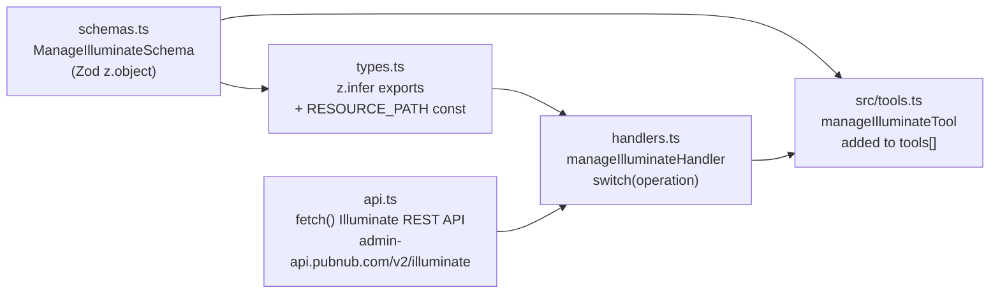
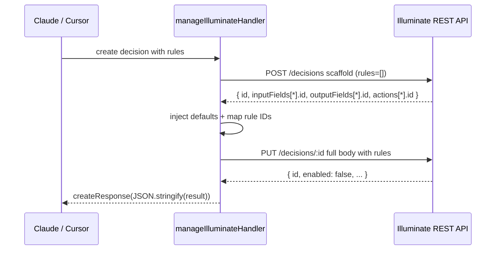
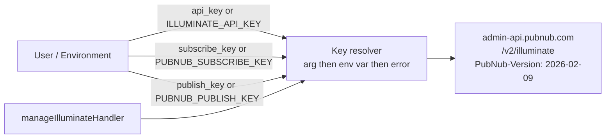

# Phase 2 — manage_illuminate Core Tool

## Target repo

```
/Users/nicolis.miller/Documents/GitHub/pubnub-mcp-server
```

Follow the exact same pattern used by the existing `src/lib/portal/` module. Read those
4 files before starting to match conventions for imports, error handling, and response
formatting.

---

## Module structure

```
src/lib/illuminate/
  schemas.ts    — Zod schema
  types.ts      — inferred types + constants
  api.ts        — HTTP client
  handlers.ts   — operation router
```



---

## schemas.ts

All rules belong in `.describe()` strings — the schema is the tool's documentation.

```typescript
const ManageIlluminateSchema = z.object({
  operation: z.enum([
    "list", "get", "create", "update", "delete",
    "activate", "deactivate", "get-fields", "execute-adhoc",
    "publish-fake-data", "verify-query", "check-action-log",
    "raw-snapshot", "aggregate", "field-health", "custom-query"
  ]).describe("Operation to perform..."),
  resource: z.enum([
    "business-object", "metric", "query", "decision", "dashboard"
  ]).optional().describe("Required for CRUD operations"),
  id:            z.string().optional(),
  data:          z.record(z.string(), z.unknown()).optional(),
  api_key:       z.string().optional()
                   .describe("Falls back to ILLUMINATE_API_KEY env var"),
  subscribe_key: z.string().optional()
                   .describe("Falls back to PUBNUB_SUBSCRIBE_KEY env var"),
  publish_key:   z.string().optional()
                   .describe("Required for publish-fake-data. Falls back to PUBNUB_PUBLISH_KEY env var"),
  // test / analysis fields (all optional):
  bo_id:         z.string().optional(),
  query_id:      z.string().optional(),
  decision_id:   z.string().optional(),
  scenario:      z.enum(["generic", "chat-flooding", "cross-posting"]).optional(),
  count:         z.number().optional(),
  user_id:       z.string().optional(),
  channel:       z.string().optional(),
  limit:         z.number().optional(),
  group_by:      z.array(z.string()).optional(),
  pipeline:      z.record(z.string(), z.unknown()).optional(),
});
```

### Critical API rules to embed in `.describe()` strings

- `hitType` (`SINGLE` or `MATCH_ALL`) and `executeOnce` (boolean) are required on every
  Decision create/update — omitting either causes HTTP 500 (not 400)
- Decision `create` runs as 2-step POST scaffold then PUT full config; the handler manages
  this transparently — callers pass the full body including rules in a single `create` call
- METRIC decisions: max 3 per account — list them and ask the user which to delete if the
  limit is hit before creating
- Saved Queries: approx 10 per account — same pattern
- Business Object must be deactivated before editing measures or dimensions
- BUSINESSOBJECT decisions require `sourceId` = BO id at the top level of `data`
- Ad-hoc query `pipeline` must include `"version": "2.0"` as a string — omitting causes 400

---

## types.ts

```typescript
import { z } from "zod";
import { ManageIlluminateSchema } from "./schemas.js";

export type ManageIlluminateSchemaType = z.infer<typeof ManageIlluminateSchema>;

export const RESOURCE_PATH: Record<string, string> = {
  "business-object": "business-objects",
  "metric":          "metrics",
  "query":           "queries",
  "decision":        "decisions",
  "dashboard":       "dashboards",
};

export interface IlluminateField {
  id?: string;
  name: string;
  source: "JSONPATH" | "DERIVED";
  jsonPath?: string;
  jsonFieldType?: "TEXT" | "TEXT_LONG" | "NUMERIC" | "TIMESTAMP" | "BOOLEAN";
}
```

---

## api.ts

Base URL: `https://admin-api.pubnub.com/v2/illuminate`
Auth header: `Authorization: <api_key>` (the key starts with `si_`)
Version header: `PubNub-Version: 2026-02-09`

Methods to implement:
- `listResources(resource, apiKey)` — GET /resource-path
- `getResource(resource, id, apiKey)` — GET /resource-path/:id
- `createResource(resource, data, apiKey)` — POST /resource-path
- `updateResource(resource, id, data, apiKey)` — PUT /resource-path/:id
- `deleteResource(resource, id, apiKey)` — DELETE /resource-path/:id
- `activateResource(resource, id, apiKey, subscribeKey?)` — PUT with isActive/enabled true
- `deactivateResource(resource, id, apiKey)` — PUT with isActive/enabled false
- `getQueryFields(queryId, apiKey)` — GET /queries/:id/fields
- `executeAdHocQuery(pipeline, apiKey)` — POST /queries/execute
- `getActionLog(decisionId, apiKey)` — GET /decisions/:id/action-log

`handleResponse` helper:
- 204 → return `{ success: true }`
- Empty body → return `{ success: true }`
- Non-2xx → throw with status + body text

### Rate limiting and retries

`api.ts` does **not** implement retry logic — this matches the existing `src/lib/portal/` module
pattern. `429 Too Many Requests` and transient `5xx` errors are thrown by `handleResponse`,
caught by the handler's `catch (e)` block, and surfaced to Claude as error responses. Claude
can then inform the user and ask them to retry. This is an explicit design decision for
consistency with the rest of the codebase.

### Pagination

`listResources` passes the full API response through without modification, including any
`next` or `offset` pagination tokens the Illuminate API returns. Callers receive the raw
response structure. This is consistent with the portal module pattern. Full pagination
support (auto-fetching all pages) is a future enhancement if needed.

---

## handlers.ts

### Decision create — 2-step workflow (hidden from caller)

The caller passes the full decision body (including rules) in a single `create` call.
The handler splits it into:

1. POST with `rules: []` and `enabled: false` → save all auto-generated IDs
2. Inject `hitType`, `executeOnce`, `activeFrom`, `activeUntil` defaults if absent
3. PUT the full body with real IDs in `rules[].inputValues[].inputFieldId` etc.



### Default injection

Always inject these fields if absent from `data` before any Decision create/update:

```typescript
const defaults = {
  hitType:     "SINGLE",
  executeOnce: false,
  activeFrom:  new Date().toISOString(),
  // Rolling 2-year window from now — avoids a hardcoded expiry date becoming stale
  activeUntil: new Date(Date.now() + 2 * 365 * 24 * 60 * 60 * 1000).toISOString(),
};
```

### Fake-data publish

For `publish-fake-data`, reuse `getPubNubClient` from `src/lib/pubnub/api.ts`.
Generate type-aware fake values based on the Business Object's field `jsonFieldType`:
- `TEXT` → random string
- `NUMERIC` → random number
- `BOOLEAN` → random boolean
- `TIMESTAMP` → ISO datetime string

Scenarios:
- `generic` — random users and channels
- `chat-flooding` — many messages from one user on one channel
- `cross-posting` — same user posting to many channels

**Key requirement for publish-fake-data:** `getPubNubClient` requires `PUBNUB_PUBLISH_KEY`
and `PUBNUB_SUBSCRIBE_KEY` (or the `publish_key` / `subscribe_key` arguments). A user who
only configured `ILLUMINATE_API_KEY` will get a confusing error. The handler must check for
these keys *before* attempting to publish and surface a clear, actionable message:

```typescript
// In the publish-fake-data branch of the handler
const publishKey = args.publish_key ?? process.env.PUBNUB_PUBLISH_KEY;
const subscribeKey = args.subscribe_key ?? process.env.PUBNUB_SUBSCRIBE_KEY;

if (!publishKey || !subscribeKey) {
  return createResponse(
    "publish-fake-data requires a PubNub keyset. " +
    "Provide your keyset's publish and subscribe keys using the publish_key and subscribe_key " +
    "arguments, or set the PUBNUB_PUBLISH_KEY and PUBNUB_SUBSCRIBE_KEY environment variables. " +
    "These are the same keys used by your PubNub application — find them in the PubNub Portal " +
    "under your keyset.",
    true
  );
}
```

### Response pattern

Match the existing portal handler pattern exactly:
- Success: `return createResponse(JSON.stringify(result))`
- Error: `return createResponse(parseError(e), true)`

---

## src/tools.ts changes

Add after the last existing tool import:

```typescript
import { manageIlluminateHandler } from "./lib/illuminate/handlers.js";
import { ManageIlluminateSchema } from "./lib/illuminate/schemas.js";
```

Define the tool:

```typescript
const manageIlluminateTool = {
  name: "manage_illuminate",
  definition: {
    title: "Manage PubNub Illuminate",
    description: `Manages PubNub Illuminate resources...

      TOOL SELECTION GUIDE — Illuminate Claude Behavior:
      1. Intent-first: Always start from the user's desired outcome. Ask what they want
         to achieve before suggesting Business Objects, Metrics, or Decisions.
      2. Preview-first: Before creating any resources, describe automation in 1-2 sentences
         and show a conditions → actions decision table. Ask for confirmation before building.
      3. Predefined templates: For spam (flooding/cross-posting) and ranking (Top N/Bottom N),
         use the Query Builder predefined templates. Never recreate these from scratch.
      4. Built-in BO fields: For chat/moderation/ranking, User/Channel/Message/Message Type
         are auto-created. Never ask users to define them.
      5. Start simple: Minimal decision for the core goal; add complexity only when requested.
      6. PubNub extension: For delayed checks, scheduling, or orchestration beyond Illuminate,
         suggest PubNub Functions or pub/sub as the first extension path.
    `,
    inputSchema: ManageIlluminateSchema,
  },
  handler: manageIlluminateHandler,
};
```

Append to `tools[]` export:

```typescript
export const tools = [
  // ...existing 12 tools...
  manageIlluminateTool,
];
```

---

## Authentication



Key resolution order: argument → env var → throw error with helpful message.

How to get a key: PubNub Portal → Service Integrations → Account-level →
Illuminate Read & Write. The key starts with `si_`.

---

## Environment config

`.env.sample` — add:

```
ILLUMINATE_API_KEY=
```

`server.json` — add to `environmentVariables[]`, and **update** the existing
`PUBNUB_PUBLISH_KEY` and `PUBNUB_SUBSCRIBE_KEY` entries to mention Illuminate:

```json
{
  "name": "ILLUMINATE_API_KEY",
  "description": "Illuminate Service Integration API key (si_...) for managing Illuminate resources. Obtain from PubNub Portal → Service Integrations → Account-level → Illuminate Read & Write.",
  "isRequired": false,
  "isSecret": true
}
```

Also update the existing `PUBNUB_PUBLISH_KEY` and `PUBNUB_SUBSCRIBE_KEY` descriptions in
`server.json` to mention the Illuminate `publish-fake-data` operation:

```json
{
  "name": "PUBNUB_PUBLISH_KEY",
  "description": "PubNub publish key for real-time operations and Illuminate publish-fake-data testing. Required when using manage_illuminate with publish-fake-data.",
  "isRequired": false,
  "isSecret": true
},
{
  "name": "PUBNUB_SUBSCRIBE_KEY",
  "description": "PubNub subscribe key for real-time operations and Illuminate publish-fake-data testing. Required when using manage_illuminate with publish-fake-data.",
  "isRequired": false,
  "isSecret": true
}
```

---

## Claude behavior instructions (full reference)

These belong in the tool's `description` field in `src/tools.ts`:

### Intent-first
Always start from the user's desired outcome. Users think in: improve engagement / reward
good behavior / stop spam or abuse / get alerts when something goes wrong / react in real time.
Never begin by explaining Business Objects, Metrics, or Decisions unless asked.

### Preview-first UX
Before creating any Illuminate resources:
1. Describe the automation in 1–2 sentences in plain English
2. Present decision logic as a conditions → actions table (one rule per row)
3. Ask for confirmation and threshold adjustments
Only build after confirmation.

### Predefined Query Builder templates
Use them. Never recreate from scratch.
- Chat flooding spam → Chat Flooding Spam template
- Cross-posting spam → Cross-Posting Spam template
- Top N ranking → Top N Rankings template
- Bottom N ranking → Bottom N Rankings template

### Built-in Business Object fields
For chat, moderation, and ranking: User, Channel, Message, Message Type are auto-created.
Never ask the user to manually define these.

### Start simple
Minimal decision for the core goal. Add complexity only when explicitly requested.

### Time-based logic
Ask if duration field exists in payload. If not, ask which timestamps exist and define
a DURATION derived field (timestamp_A minus timestamp_B). CURRENT_TIMESTAMP not supported.

### PubNub extension
For delayed checks, scheduling, orchestration beyond Illuminate: suggest PubNub pub/sub,
Functions, or MCP Server. Illuminate handles decisioning; PubNub handles events/scheduling.
